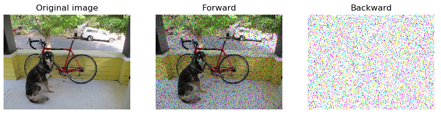

# DropOut Layer

**Overfitting** is a real problem for Convolutional Neural Network and, in general, for every Machine Learning systems. In general, it's easy to identify an overfitted model since it will perfoms very well on the training dataset while it's accuracy in a completely different set of data will drop a lot.
To avoid overfitting means to create a generalized model, that can works well in different datasets.

One of the method to avoid overfitting is by the use of a DropOut layer: all it does is setting to zero a randomly chosen set of neuron from the outputs of a previous layer. By doing so the layer temporarily removes that neuron from the network (the neuron is said to be *dropped out*).

For a deeper explanation of the drop out operation you can take a look at the [original paper](http://jmlr.org/papers/volume15/srivastava14a/srivastava14a.pdf)   or this [usefull blog post](https://machinelearningmastery.com/dropout-for-regularizing-deep-neural-networks/) that sums it up.

In the image below ther's an example output of a single image processed by the DropOut layer:



The black dots are the dropped pixel (or neuron), while in the backward the delta is passed only through the remaing pixels.

That's a simple example on how to use the layer as a single operation (also used to produce the image above):

```python
import os
from random

np.random.seed(123)


# those function rescale the image: [0,255]->[0,1] and [0,1]->[0,255]
img_2_float = lambda im : ((im - im.min()) * (1./(im.max() - im.min()) * 1.)).astype(float)
float_2_img = lambda im : ((im - im.min()) * (1./(im.max() - im.min()) * 255.)).astype(np.uint8)

filename = os.path.join(os.path.dirname(__file__), '..', '..', 'data', 'dog.jpg')
inpt = np.asarray(Image.open(filename), dtype=float)  # it's not really meaningfull on a random image
inpt.setflags(write=1)
inpt = img_2_float(inpt)

# adding batch dimension
inpt = np.expand_dims(inpt, axis=0)

prob = 0.1 # drops probability

layer = Dropout_layer(prob=prob)

# FORWARD

layer.forward(inpt)
forward_out = layer.output # of same shape as the input

# BACKWARD

delta = np.ones(shape=inpt.shape, dtype=float)
layer.delta = np.ones(shape=layer.out_shape, dtype=float)
layer.backward(delta)

# and here delta is correctly updated and ready to pe passed backward
```

To have a look more in details on what's happening, the definitons of `forward` and `backward` function are:

```python
def forward(self, inpt):
  '''
  Forward function of the Dropout layer: it create a random mask for every input
    in the batch and set to zero the chosen values. Other pixels are scaled
    with the scale variable.
  Parameters :
    inpt : array of shape (batch, w, h, c), input of the layer
  '''

  self._out_shape = inpt.shape

  self.rnd = np.random.uniform(low=0., high=1., size=self.out_shape) > self.probability
  self.output = self.rnd * inpt * self.scale
  self.delta = np.zeros(shape=inpt.shape)
```

The code proceeds as follow:
  * create a random mask
  * multiply the mask (element-wise) to inpt and multiply for `self.scale`
  * initialize `self.delta`


while if `prob=1`, `scale` is set to one, but it doesn't really matter, since every pixel is zero at that point, it's just to avoid the division.

The backward function is:

```python
def backward(self, delta=None):
  '''
  Backward function of the Dropout layer: given the same mask as the layer
    it backprogates delta only to those pixel which values has not been set to zero
    in the forward.
  Parameters :
    delta : array of shape (batch, w, h, c), default value is None.
          If given, is the global delta to be backpropagated
  '''

  if delta is not None:
    self.delta = self.rnd * self.delta * self.scale
    delta[:] = self.delta.copy()
```

Tha backward multiply `delta` by scale only for the pixel unaffected by the "dropout".
Then the mask sets to zero the correspondnt values of `self.delta`, and `delta` is updated.
