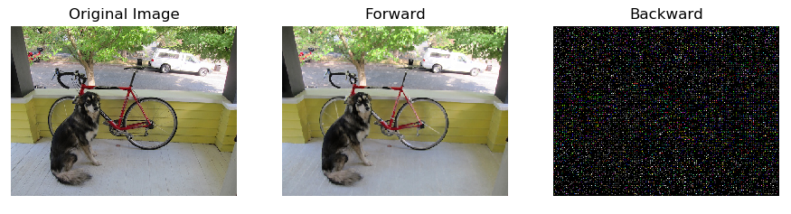
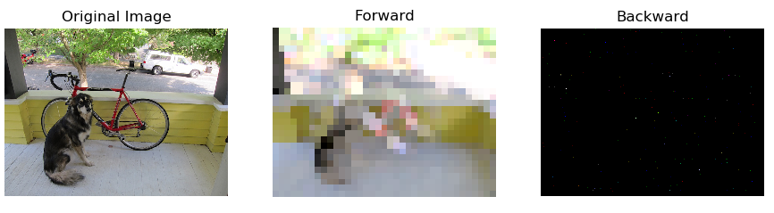

### Max Pooling Layer

In general, Pooling layers execute some kind of down-sample operations. The algorithm is the same as for average pool layer: a kernel of size *k* is slided over the images of the batch, and for every window a certain function is computed.
In this case the output will be the maximum value between the pixel of the same window.
In the animation below an example of the output


*Fig: maxpooling example of a 4 x 4 x 1 image, with kernel size k = 2, orizontal and vertical stride s = 2*

In case the combination of kernel size, stride and image dimension doesn't allow all rows and columns to be in a window, the picture can be padded: this means that a certain number of rows/columns are added to every images in the batch. (nan values)

The output dimensions depend from the original image, kernel, stride and pad values, in particular:

<a href="https://www.codecogs.com/eqnedit.php?latex=out\_width&space;=&space;\lfloor&space;\frac{width&space;&plus;&space;pad\_w&space;-&space;k}{stride}&space;\rfloor&space;&plus;&space;1" target="_blank"></a>

<a href="https://www.codecogs.com/eqnedit.php?latex=out\_height&space;=&space;\lfloor&space;\frac{height&space;&plus;&space;pad\_h&space;-&space;k}{stride}&space;\rfloor&space;&plus;&space;1" target="_blank"></a>

And the output shape will be `(batch, out_width, out_height, c )`.

Usually, Pooling layers are used to avoid the problem of sensitiveness to features location: a downsample makes a CNN more robust to change in the features position in the image , referred as *local transation invariance*. Maxpooling summarizes the most activated presence of a feature.

In the image below, we show some examples of the effect of differnet kernel (size, stride) on the input image.



*Fig. : Effects of maxpooling the same image with differents size/stride. From above: kernel size = 3, stride = 2, and size = 30, stride = 20*

In the example code below we show how to use the single layer:

```python
from NumPyNet.layers.maxpool_layer import Maxpool_layer # class import

import numpy as np # the library is entirely based on numpy

batch, w, h, c = (5, 100, 100, 3) # you can also load an image from a file, but is import to have all 4 dimensions (batch, w, h, c)
input = np.random.uniform(low=0., high=1., size=(batch, w, h, c))

# Parameters definition
size   = 3
stride = 2
pad    = False

layer = Maxpool_layer(size=size, stride=stride, pad=pad)

# forward
layer.forward(inpt=input)
output = layer.output # of shape (batch, out_width, out_height, c)

# bacward
layer.delta = np.random.uniform(0, 1, size=output.shape) # it ideally comes from the next layer
delta 			= np.zeros(shape=input.shape)
layer.backward(delta=delta)

# now delta is updated and ready to be passed backward
```

To have a look more in details, here the defitions of `forward` and `backward`:

```python
def forward(self, inpt):
	'''
	Forward function of the maxpool layer: It slides a kernel over every input image and return
	the maximum value of every sub-window.
	the function _asStride returns a view of the input arrary with shape
	(batch, out_w, out_h , c, kx, ky), where, for every image in the batch we have:
	out_w * out_h * c sub matrixes kx * ky, containing pixel values.

	Parameters:
		inpt : input images in the format (batch, input_w, input_h, input_c)
	'''

	self.batch, self.w, self.h, self.c = inpt.shape
	kx , ky  = self.size
	st1, st2 = self.stride

	if self.pad:
		self._evaluate_padding()
		mat_pad = self._pad(inpt)
	else:
		# If no padding, cut the last raws/columns in every image in the batch
		mat_pad = inpt[:, : (self.w - kx) // st1*st1 + kx, : (self.h - ky) // st2*st2 + ky, ...]

	# Return a strided view of the input array, shape: (batch, 1+(w-kx)//st1,1+(h-ky)//st2 ,c, kx, ky)
	view = self._asStride(mat_pad, self.size, self.stride)

	self.output = np.nanmax(view, axis=(4, 5)) # final shape (batch, out_w, out_h, c)

	# New shape for view, to access the single sub matrix and retrieve couples of indexes
	new_shape = (np.prod(view.shape[:-2]), view.shape[-2], view.shape[-1])

	# Retrives a tuple of indexes (x,y) for every sub-matrix of the view array, that indicates
	# where the maximum value is.
	# In the loop I change the shape of view in order to have access to its last 2 dimension with r.
	# r take the values of every sub matrix
	self.indexes = [np.unravel_index(np.nanargmax(r), r.shape) for r in view.reshape(new_shape)]
	self.indexes = np.asarray(self.indexes).T
	self.delta   = np.zeros(shape=self.out_shape, dtype=float)
```

`forward` is very similar to what has already been described for [Average Pool Layers](./avgpool_layer.md), the only differences are:

	* After `view` is created, the function call for `numpy.nanmax`, instead of averaging. `nanmax` is able to avoid the nan padding
	* After that, `view` is reshaped to (batch * out_w * out_h * c, Kx, Ky): in that way, a `for` loop over `view.reshape(new_shape)` is able to acces every Kx * Ky matrix, that contains every window slided by the kernel.
	* `self.index` stores couples of indexes: those couples are the `i,j` position of the max inside every window. So there will be batch * out_w * out_h * c couples.
	* the transposition is used in `backward` to retrieves the exact position of the maxima in `delta` array

```python
def backward(self, delta):
	'''
	Backward function of maxpool layer: it access avery position where in the input image
	there's a chosen maximum and add the correspondent self.delta value.
	Since we work with a 'view' of delta, the same pixel may appear more than one time,
	and an atomic acces to it's value is needed to correctly modifiy it.

	Parameters:
		delta : the global delta to be backpropagated with shape (batch, w, h, c)
	'''

	# Padding delta in order to create another view
	if self.pad:
		mat_pad = self._pad(delta)
	else:
		mat_pad = delta

	# Create a view of net delta, following the padding true or false
	net_delta_view = self._asStride(mat_pad, self.size, self.stride) #that is a view on mat_pad

	# Create every possibile combination of index for the first four dimensions of
	# a six dimensional array
	b, w, h, c = self.output.shape
	combo = itertools.product(range(b), range(w), range(h), range(c))
	combo = np.asarray(list(combo)).T
	# here I left the transposition, because of self.indexes

	# those indexes are usefull to acces 'Atomically'(one at a time) every element in net_delta_view
	# that needs to be modified
	for b, i, j, k, x, y in zip(combo[0], combo[1], combo[2], combo[3], self.indexes[0], self.indexes[1]):
		net_delta_view[b, i, j, k, x, y] += self.delta[b, i, j, k]

	# Here delta is correctly modified
	if self.pad:
		_ , w_pad, h_pad, _ = mat_pad.shape
		delta[:] = mat_pad[:, self.pad_top : w_pad-self.pad_bottom, self.pad_left : h_pad - self.pad_right, :]
	else:
		delta[:] = mat_pad
```

`backward` works the same as for the [Average Pool Layers](./avgpool_layer.md), the only difference is that `self.delta` is passed only for the pixels that have been chosen in `forward` as maxima.
