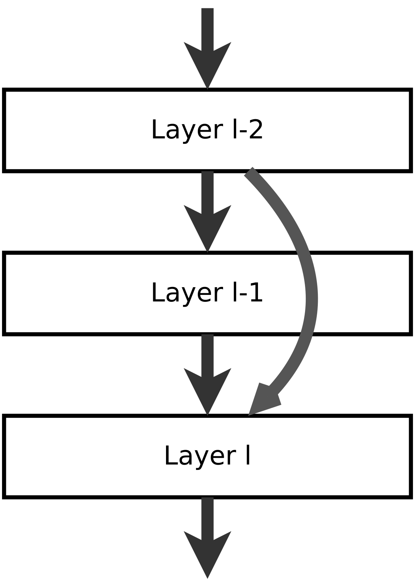

# Shortcut Layer

Deep Neural Networks model suffer from the degradation problem, i.e. the accuracy reduction with increasing depth of the network; Moreover, the accuracy loss happens in the training dataset.

In [the original paper](https://arxiv.org/pdf/1512.03385.pdf), they addres the degradation problem by introducing a *deep residual learning* framework, or *shortcut connections*, that skips one ore more layers (as shown in the figure below), without introducing extra parameters or computational cost.

In the original paper, the shortcut connections perform an operation like:

&space;=&space;F(x)&space;&plus;&space;x)

Where `F(x)` is the ouput of layer l-1, `x` is the output of the layer l-2, and `H(x)` is the output of the layer l, or `Shortcut_layer` (see image below for reference).



The object `Shortcut_layer` is an implementation of this concept, where is possible to add weights to the linear combination, &alpha; and &beta;, as :

<p align="center">
	<a href="https://www.codecogs.com/eqnedit.php?latex=H(x)&space;=&space;\alpha&space;F(x)&space;&plus;&space;\beta&space;x" target="_blank"></a>
</p>

And it can actually deal with different sized inputs.
The code below shows an example on how to use the single shortcut layer `forward` and `backward`:

```python
# first the essential import for the library.
# after the installation:
from NumPyNet.layers.shortcut_layer import Shortcut_layer # class import
from NumPyNet import activations

import numpy as np # the library is entirely based on numpy

# define a batch of images (even a single image is ok, but is important that it has all the four dimensions) in the format (batch, width, height, channels)

batch, w, h, c = (5, 100, 100, 3) # batch != 1 in this case
input1 = np.random.uniform(low=0., high=1., size=(batch, w, h, c)) # you can also import some images from file
input2 = np.random.uniform(low=0., high=1., size=(batch, w, h, c)) # second input

alpha = 0.75
beta  = 0.5

activ_func = activations.Relu() # it can also be:
															 #     activations.Relu  (class Relu)
															 #     "Relu" (a string, case insensitive)

# Layer initialization, with parameters scales and bias
layer = Shortcut_layer(activation=activ_func, alpha=0.75, beta=0.5)


# Forward pass
layer.forward(inpt=input1, prev_output=input2)
out_img = layer.output    # the output in this case will be a batch of images of shape = (batch, out_width, out_heigth , out_channels)

# Backward pass
delta       = np.random.uniform(low=0., high=1., size=input.shape)     # definition of network delta, to be backpropagated
layer.delta = np.random.uniform(low=0., high=1., size=out_img.shape)   # layer delta, ideally coming from the next layer
layer.backward(delta, copy=False)

# now net_delta is modified and ready to be passed to the previous layer.delta
# and also the updates for weights and bias are computed in the backward
```

To have a look more in details on what's happening, the defintions of `forward` and `backward` are:

```python
def forward(self, inpt, prev_output):
	'''
	Forward function of the Shortcut layer: activation of the linear combination between input

	Parameters:
		inpt        : array of shape (batch, w, h, c), first input of the layer
		prev_output : array of shape (batch, w, h, c), second input of the layer
	'''
	# assert inpt.shape == prev_output.shape

	self._out_shape = [inpt.shape, prev_output.shape]

	if inpt.shape == prev_output.shape:
		self.output = self.alpha * inpt[:] + self.beta * prev_output[:]

	else:

		# If the layer are combined the smaller one is distributed according to the
		# sample stride
		# Example:
		#
		# inpt = [[1, 1, 1, 1],        prev_output = [[1, 1],
		#         [1, 1, 1, 1],                       [1, 1]]
		#         [1, 1, 1, 1],
		#         [1, 1, 1, 1]]
		#
		# output = [[2, 1, 2, 1],
		#           [1, 1, 1, 1],
		#           [2, 1, 2, 1],
		#           [1, 1, 1, 1]]

		if (self.ix, self.iy, self.kx) is (None, None, None):
			self._stride_index(inpt.shape, prev_output.shape)

		self.output = inpt.copy()
		self.output[:, ix, jx, kx] = self.alpha * self.outpu[:, ix, jx, kx] + self.beta * prev_output[:, iy, jy, ky]


	self.output = self.activation(self.output)
	self.delta = np.zeros(shape=self.out_shape, dtype=float)
```

If the shapes of the two inputs are identical, then the output is the simple linear combinations of the two.
If that's not the case, the function `_stride_index` computes the indices (for both inputs) which corresponding positions will be combined togheter.

```python
def backward(self, delta, prev_delta):
	'''
	Backward function of the Shortcut layer

	Parameters:
		delta      : array of shape (batch, w, h, c), first delta to be backpropagated
		delta_prev : array of shape (batch, w, h, c), second delta to be backporpagated

	'''

	# derivatives of the activation funtion w.r.t. to input
	self.delta *= self.gradient(self.output)

	delta[:]   += self.delta * self.alpha

	if (self.ix, self.iy, self.kx) is (None, None, None): # same shapes
		prev_delta[:] += self.delta[:] * self.beta

	else: # different shapes
		prev_delta[:, self.ix, self.jx, self.kx] += self.beta * self.delta[:, self.iy, self.jy, self.ky]
```

`backward` makes use of the same indixes to backpropagate delta for both input layers.
